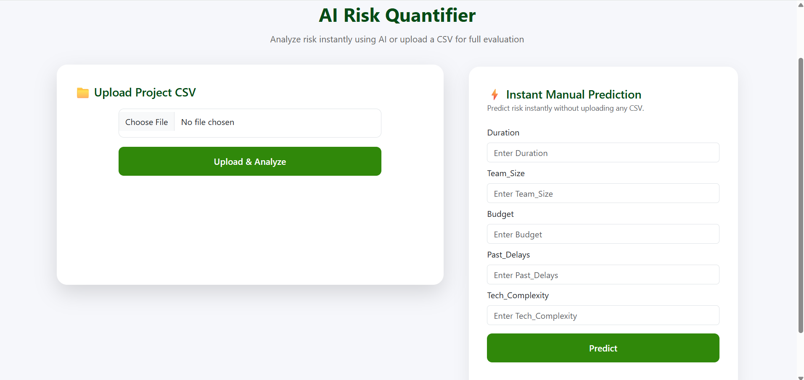
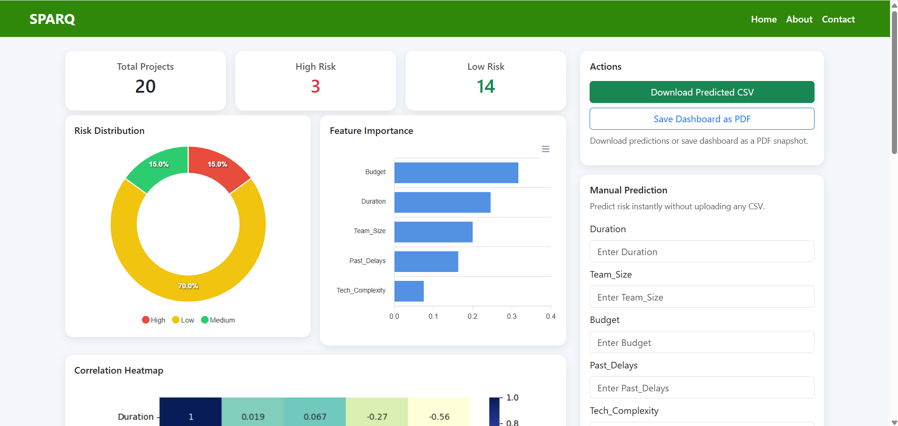
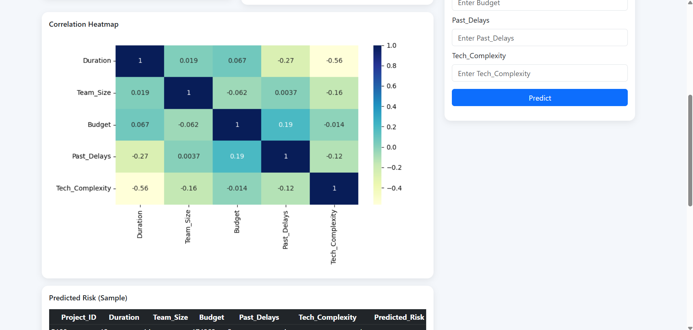
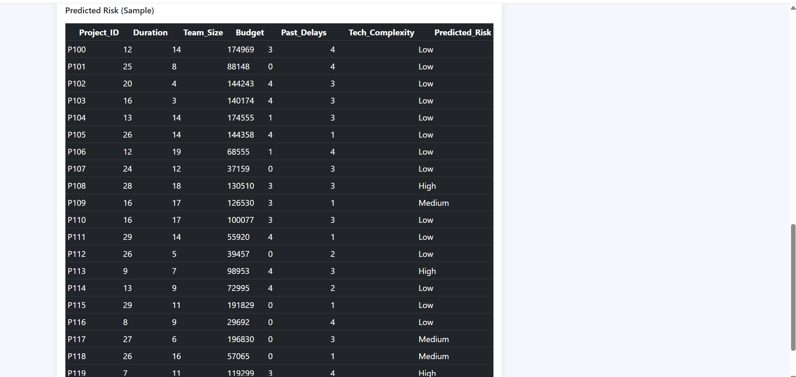

# AI Risk Quantifier (SPARQ)

**SPARQ (Software Project AI Risk Quantifier)** is a machine learning-based web application designed to analyze software project characteristics and predict the potential risk level of a project.

The system uses a **Random Forest Classifier** to evaluate important project factors such as project duration, team size, budget, past delays, and technology complexity.

---

##  Features

- Upload project datasets in CSV format
- Automatic data preprocessing
- Machine learning-based risk prediction
- Random Forest classification
- Project risk analysis
- Risk-level prediction
- Interactive dashboard
- Data visualization
- Trained machine learning model
- Support for model training using labeled datasets

---

##  Machine Learning

SPARQ uses a **Random Forest Classifier** for software project risk prediction.

The model analyzes important project characteristics including:

| Feature | Description |
|---|---|
| Duration | Expected or actual project duration |
| Team Size | Number of team members involved |
| Budget | Project budget |
| Past Delays | Previous project delays |
| Tech Complexity | Complexity of the technology used |

The input data is preprocessed before being passed to the machine learning model, which then predicts the project risk level.

---

##  System Workflow

```text
                  Project Dataset
                        │
                        ▼
                 CSV File Upload
                        │
                        ▼
                Data Preprocessing
                        │
                        ▼
                 Feature Processing
                        │
                        ▼
              Random Forest Model
                        │
                        ▼
                  Risk Prediction
                        │
                        ▼
              Dashboard & Analysis
```

---

##  Technologies Used

### Programming Language

- Python

### Backend

- Flask

### Machine Learning

- Scikit-learn
- Random Forest Classifier
- Label Encoding
- Joblib

### Data Processing

- Pandas
- NumPy

### Frontend

- HTML5
- CSS3
- JavaScript
- Bootstrap

### Development Tools

- Git
- GitHub
- Visual Studio Code
- Python Virtual Environment

---

##  Project Structure

```text
AI-Risk-Quantifier/
│
├── models/
│   ├── sparq_rf_model.joblib
│   └── complexity_encoder.joblib
│
├── static/
│
├── templates/
│   ├── dashboard.html
│   ├── index.html
│   └── layout.html
│
├── uploads/
│
├── app.py
├── generate_synthetic_data.py
├── train_save.py
├── requirements.txt
├── SPARQ_training_data.csv
└── SPARQ_training_data_5000.csv
```

---

##  Application Screenshots

### Home Page



### Risk Analysis Dashboard



### Correlation Heatmap



### Predicted Risk Results



---

##  Installation

### 1. Clone the Repository

```bash
git clone https://github.com/Sulalakv/AI-Risk-Quantifier.git
```

### 2. Navigate to the Project

```bash
cd AI-Risk-Quantifier
```

### 3. Create a Virtual Environment

```bash
python -m venv .venv
```

### 4. Activate the Virtual Environment

#### Windows

```bash
.venv\Scripts\activate
```

#### macOS / Linux

```bash
source .venv/bin/activate
```

### 5. Install Dependencies

```bash
pip install -r requirements.txt
```

---

##  Run the Application

Start the Flask application using:

```bash
python app.py
```

The application will run locally at:

```text
http://127.0.0.1:5000
```

Open the URL in your browser to access the application.

---

## 📊 How It Works

### Step 1: Upload Dataset

The user uploads a project dataset in CSV format through the web application.

### Step 2: Data Preprocessing

The application cleans and preprocesses the uploaded data and prepares the required features for prediction.

### Step 3: Feature Processing

Important project characteristics such as duration, team size, budget, past delays, and technology complexity are processed for the machine learning model.

### Step 4: Risk Prediction

The processed data is passed to the trained Random Forest Classifier.

### Step 5: Dashboard

The predicted project risk and analysis are presented through the application's dashboard.

---

##  Dataset

The repository contains sample training datasets:

- `SPARQ_training_data.csv`
- `SPARQ_training_data_5000.csv`

These datasets contain project-related information used for developing and training the risk prediction model.

---

##  Model

The project uses the **Random Forest Classifier** from Scikit-learn.

The trained model is stored using Joblib:

```text
models/sparq_rf_model.joblib
```

The project also uses an encoder for processing technology complexity:

```text
models/complexity_encoder.joblib
```

This allows the application to reuse the trained model for making predictions.

---

##  Project Objective

The main objective of **SPARQ** is to provide an intelligent approach to software project risk assessment.

By analyzing important project characteristics, the system can help identify potential risks at an early stage and support better project planning and decision-making.

---

##  Future Improvements

- Improve prediction accuracy using larger real-world datasets
- Compare multiple machine learning algorithms
- Improve dashboard visualizations
- Add user authentication
- Store project prediction history
- Add project reports and downloadable results
- Deploy the application to a cloud platform
- Add REST API support
- Improve real-time risk monitoring

---

## Author

**Khadeeja Sulala K V**

MCA | Python Backend Developer | Machine Learning Enthusiast

### GitHub

https://github.com/Sulalakv

---

## ⭐ Project

If you find this project useful, consider giving the repository a star.

**AI Risk Quantifier (SPARQ)**  
*Machine Learning • Python • Flask • Scikit-learn*

